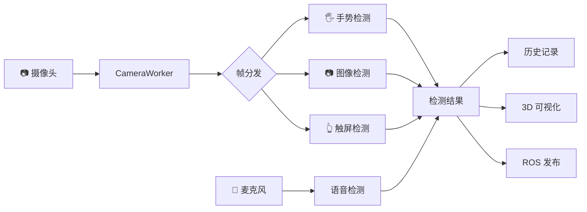
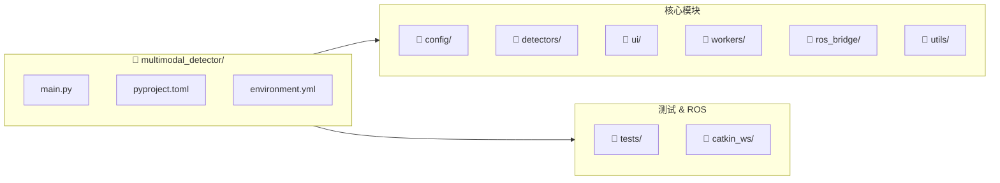

# 多模态检测器 (Multimodal Detector)

[](https://www.python.org/downloads/)
[](https://doc.qt.io/qtforpython/)
[](https://opensource.org/licenses/MIT)
[]()

基于 **PySide6 + OpenCV** 的多模态人机交互系统，集成语音识别、手势识别、图像识别和触屏指令检测四种交互模态，支持无人机集群的 3D 可视化控制和 ROS 集成。

<p align="center">
  
</p>

## 目录

- [功能特性](#功能特性)
- [系统架构](#系统架构)
- [系统要求](#系统要求)
- [安装指南](#安装指南)
- [快速开始](#快速开始)
- [项目结构](#项目结构)
- [配置说明](#配置说明)
- [使用指南](#使用指南)
- [API 文档](#api-文档)
- [开发指南](#开发指南)
- [常见问题](#常见问题)
- [更新日志](#更新日志)
- [许可证](#许可证)

## 功能特性

### 四种交互模态

| 模态 | 技术方案 | 功能描述 |
|------|----------|----------|
| 🎤 **语音识别** | OpenAI Whisper | 实时语音转文字，支持中英文指令识别 |
| 🖐️ **手势识别** | MediaPipe Hands | 21 点手部关键点检测，识别 8+ 种手势 |
| 📷 **图像识别** | YOLOv8 | 80+ 类物体实时检测，可自定义模型 |
| 👆 **触屏指令** | OpenCV | 支持点击、双击、拖拽、形状绘制 |

### 3D 无人机集群可视化

- **实时渲染**: 基于 PyQtGraph + OpenGL 的高性能 3D 可视化
- **编队控制**: 支持三角形、方形、圆形、五角星、直线等编队
- **路径规划**: APF (人工势场) 算法避障
- **障碍物仿真**: 圆柱体/方块障碍物点云渲染

### ROS 集成

- 支持 ROS1 (rospy) 无缝集成
- 发布集群控制指令和编队信息
- 订阅集群状态更新
- 可视化 Marker 发布

### 其他特性

- 📊 **检测历史记录**: 时间线式检测结果展示，支持 JSON 导出
- ⚙️ **YAML 配置系统**: 灵活的配置管理，支持热重载
- 📝 **统一日志系统**: 控制台 + 文件双输出，支持日志轮转
- 🎨 **现代化 UI**: 深色主题，响应式布局
- 🔌 **USB 麦克风支持**: 可配置外接音频设备

## 系统架构

```mermaid
graph TB
    subgraph UI["🖥️ Main Window (PySide6)"]
        subgraph Left["控制面板"]
            CP[Control Panel]
            CB1["☑ 语音识别"]
            CB2["☑ 手势识别"]
            CB3["☑ 图像识别"]
            CB4["☑ 触屏检测"]
        end
        subgraph Center["视频显示"]
            VW[Video Widget]
            VO[Voice Overlay]
            CF[Camera Feed]
        end
        subgraph Right["3D 集群视图"]
            SV[Swarm View 3D]
            OGL[OpenGL Scene]
            DR[6x Drones]
        end
    end

    subgraph Backend["⚙️ 后端模块"]
        subgraph Workers["Workers"]
            CW[CameraWorker]
            GW[GestureWorker]
        end
        subgraph Detectors["Detectors"]
            VD[VoiceDetector]
            GD[GestureDetector]
            ID[ImageDetector]
            TD[TouchDetector]
        end
        subgraph ROS["ROS Bridge"]
            RC[/swarm/command]
            RS[/swarm/status]
            RF[/swarm/formation]
        end
    end

    CP --> Workers
    VW --> Detectors
    SV --> ROS
    CW --> CF
    Detectors --> VW
    ROS --> SV
```

### 数据流程



## 系统要求

### 硬件要求

| 组件 | 最低配置 | 推荐配置 |
|------|----------|----------|
| CPU | 4 核 2.0GHz | 8 核 3.0GHz+ |
| 内存 | 8 GB | 16 GB+ |
| GPU | 集成显卡 | NVIDIA GTX 1060+ (CUDA) |
| 摄像头 | 720p USB | 1080p USB/内置 |
| 麦克风 | 内置/USB | 高质量 USB 麦克风 |

### 软件要求

- **操作系统**: Ubuntu 20.04 / 22.04 LTS
- **Python**: 3.10 或 3.11
- **CUDA**: 11.8+ (可选，用于 GPU 加速)
- **ROS**: Noetic (可选，用于 ROS 集成)

## 安装指南

### 方式一: Conda 环境 (推荐)

```bash
# 克隆仓库
git clone https://github.com/Nathanielneil/multimodal_detector.git
cd multimodal_detector

# 创建并激活环境
conda env create -f environment.yml
conda activate multimodal

# 验证安装
python -c "import PySide6; import cv2; import whisper; print('安装成功!')"
```

### 方式二: pip 安装

```bash
# 创建虚拟环境
python -m venv venv
source venv/bin/activate

# 安装依赖
pip install -e .

# 安装开发依赖 (可选)
pip install -e ".[dev]"
```

### 方式三: ROS 集成安装

```bash
# 安装 ROS 依赖
pip install -e ".[ros]"

# 编译 ROS 工作空间
cd catkin_ws
catkin_make
source devel/setup.bash
```

### GPU 加速配置 (可选)

```bash
# 安装 CUDA 版本的 PyTorch
pip install torch torchvision torchaudio --index-url https://download.pytorch.org/whl/cu118

# 验证 CUDA
python -c "import torch; print(f'CUDA: {torch.cuda.is_available()}')"
```

## 快速开始

### 基本启动

```bash
# 激活环境
conda activate multimodal

# 启动应用
python main.py
```

### 带配置启动

```bash
# 使用自定义配置
cp config/default.yaml config/config.yaml
# 编辑 config/config.yaml
python main.py
```

### 命令行参数

```bash
# 查看帮助
python main.py --help

# 指定摄像头
python main.py --camera 1

# 调试模式
python main.py --debug
```

## 项目结构



| 目录 | 说明 | 主要文件 |
|------|------|----------|
| `config/` | 配置模块 | `config.py`, `default.yaml` |
| `detectors/` | 检测器模块 | `voice_detector.py`, `gesture_detector.py`, `image_detector.py`, `touch_detector.py` |
| `ui/` | UI 组件 | `main_window.py`, `video_widget.py`, `swarm_view_3d.py` |
| `workers/` | 后台线程 | `camera_worker.py`, `gesture_worker.py` |
| `ros_bridge/` | ROS 桥接 | `ros_bridge.py` |
| `utils/` | 工具模块 | `logger.py` |
| `tests/` | 测试用例 | `test_config.py`, `test_detectors.py` |
| `catkin_ws/` | ROS 工作空间 | `swarm_visualizer/` |

## 配置说明

配置文件位于 `config/default.yaml`，支持以下配置项：

### 应用配置

```yaml
app:
  name: "Multimodal Detector"
  version: "2.14.0"
  language: "zh"  # zh, en
```

### 检测器配置

```yaml
# 语音检测器
voice:
  model_name: "small"  # tiny, base, small, medium, large
  language: "zh"
  audio_device: null   # null=默认, 数字=设备ID

# 手势检测器
gesture:
  max_hands: 1
  model_complexity: 0  # 0=Lite, 1=Full, 2=Heavy
  min_detection_confidence: 0.7
  skip_frames: 4       # 跳帧优化

# 图像检测器
image:
  model_name: "yolov8n"  # n/s/m/l/x
  confidence_threshold: 0.5
  skip_frames: 5
```

### 3D 可视化配置

```yaml
visualization:
  arena_size: 32        # 场地大小 (米)
  drone_count: 6        # 无人机数量
  apf_enabled: true     # APF 避障
```

### 日志配置

```yaml
logging:
  level: "INFO"         # DEBUG, INFO, WARNING, ERROR
  file:
    enabled: true
    path: "logs/multimodal_detector.log"
    max_bytes: 10485760  # 10MB
    backup_count: 5
```

## 使用指南

### 界面布局


| 时间 | 模态 | 命令 | 置信度 |
|------|------|------|--------|
| 12:30:15 | 🖐️ 手势 | 起飞 | 0.95 |
| 12:31:02 | 🎤 语音 | 三角编队 | 0.88 |
| 12:32:45 | 👆 触屏 | 圆形编队 | 0.92 |

### 基本操作流程

1. **启动摄像头**: 点击「启动摄像头」按钮
2. **启用模态**: 勾选需要的检测模态
3. **语音录制**: 点击「🎤 录音」按钮，说出指令
4. **触屏绘制**: 在视频区域拖拽绘制形状
5. **3D 控制**: 使用右侧按钮控制无人机集群
6. **导出历史**: 点击「导出历史」保存检测记录

### 支持的手势

| 手势 | 名称 | 对应指令 |
|------|------|----------|
| ✊ | 握拳 | 集群降落 |
| 🖐️ | 张开手掌 | 集群起飞 |
| ☝️ | 食指指向 | 集群悬停 |
| 👍 | 竖起大拇指 | 高度上升 |
| 👎 | 向下大拇指 | 高度下降 |
| ✌️ | 比 V | 向前飞行 |
| 👌 | OK 手势 | 指令确认 |
| 🤟 | 摇滚/ILY | 编队飞行 |

### 支持的语音指令

| 指令类别 | 关键词示例 |
|----------|------------|
| 起飞 | "起飞", "升空", "takeoff" |
| 降落 | "降落", "着陆", "land" |
| 悬停 | "悬停", "停住", "hover" |
| 上升 | "上升", "高一点", "go up" |
| 下降 | "下降", "低一点", "go down" |
| 前进 | "向前飞", "forward" |
| 编队 | "三角编队", "圆形编队", "方形编队" |

### 支持的触屏形状

| 形状 | 对应编队 |
|------|----------|
| △ 三角形 | 三角编队 |
| □ 正方形 | 方形编队 |
| ○ 圆形 | 圆形编队 |
| ☆ 五角星 | 星形编队 |
| — 直线 | 直线编队 |

## API 文档

### 检测器基类

```python
from detectors.base_detector import BaseDetector, DetectionResult

class CustomDetector(BaseDetector):
    def initialize(self) -> bool:
        """初始化检测器"""
        pass

    def detect(self, data: Any) -> Optional[DetectionResult]:
        """执行检测"""
        pass

    def cleanup(self):
        """清理资源"""
        pass
```

### 检测结果

```python
@dataclass
class DetectionResult:
    modal_type: str      # 模态类型
    command: str         # 检测到的命令
    confidence: float    # 置信度 (0-1)
    timestamp: datetime  # 时间戳
    raw_data: Any        # 原始数据
    metadata: Dict       # 元数据
```

### 配置管理器

```python
from config import config

# 读取配置
model_name = config.get("voice.model_name", "small")

# 嵌套配置
log_level = config.get("logging.level", "INFO")
```

### 日志系统

```python
from utils.logger import get_logger

logger = get_logger(__name__)
logger.info("信息日志")
logger.debug("调试日志")
logger.error("错误日志", exc_info=True)
```

## 开发指南

### 环境设置

```bash
# 安装开发依赖
pip install -e ".[dev]"

# 运行测试
pytest

# 运行测试 (带覆盖率)
pytest --cov=. --cov-report=html

# 代码格式化
black .
isort .

# 类型检查
mypy .

# 代码检查
flake8
```

### 添加新检测器

1. 创建检测器类，继承 `BaseDetector`
2. 实现 `initialize()`, `detect()`, `cleanup()` 方法
3. 在 `main_window.py` 中注册检测器
4. 添加对应的配置项到 `default.yaml`

### 项目规范

- 代码风格: Black (88 字符行宽)
- 导入排序: isort
- 类型注解: 必须
- 文档字符串: Google 风格
- 测试: pytest

## 常见问题

### Q: 摄像头无法启动

```bash
# 检查摄像头设备
ls /dev/video*

# 测试摄像头
python -c "import cv2; cap=cv2.VideoCapture(0); print(cap.isOpened())"

# 可能需要安装 v4l-utils
sudo apt install v4l-utils
v4l2-ctl --list-devices
```

### Q: Whisper 模型下载失败

```yaml
# 配置代理 (config/config.yaml)
proxy:
  enabled: true
  http: "http://127.0.0.1:7890"
  https: "http://127.0.0.1:7890"
```

### Q: GPU 加速不工作

```bash
# 检查 CUDA
nvidia-smi
python -c "import torch; print(torch.cuda.is_available())"

# 重新安装 PyTorch CUDA 版本
pip uninstall torch torchvision
pip install torch torchvision --index-url https://download.pytorch.org/whl/cu118
```

### Q: 麦克风设备选择

```python
# 列出可用设备
import sounddevice as sd
print(sd.query_devices())
```

```yaml
# 配置指定设备 (config/config.yaml)
voice:
  audio_device: 7  # 设备 ID
```

### Q: ROS 连接失败

```bash
# 确保 ROS Master 运行
roscore

# 检查环境变量
echo $ROS_MASTER_URI

# 在新终端中
source /opt/ros/noetic/setup.bash
source catkin_ws/devel/setup.bash
python main.py
```

## 更新日志

### v2.14.0 (2025-01-08)

- ✨ 新增 YAML 配置系统 (`config/`)
- ✨ 新增统一日志模块 (`utils/logger`)
- ✨ 新增测试框架 (`tests/`)
- ♻️ 重构检测器，支持配置化参数
- 🐛 修复裸异常捕获问题
- 📝 添加类型注解

### v2.13.0 (2024-12-18)

- ✨ 新增 3D 无人机集群可视化
- ✨ 新增 ROS Bridge 集成
- ✨ 新增 USB 麦克风支持
- ✨ 新增语音可视化叠加层
- ✨ 新增 APF 避障算法

### v1.1.0 (2024-12-16)

- 🎉 初始版本发布
- ✨ 四模态检测器实现
- ✨ 基础 UI 框架

## 许可证

本项目采用 [MIT License](LICENSE) 开源许可证。

## 致谢

- [OpenAI Whisper](https://github.com/openai/whisper) - 语音识别
- [MediaPipe](https://mediapipe.dev/) - 手势识别
- [Ultralytics YOLOv8](https://github.com/ultralytics/ultralytics) - 物体检测
- [PySide6](https://doc.qt.io/qtforpython/) - GUI 框架
- [PyQtGraph](https://www.pyqtgraph.org/) - 3D 可视化
- [ego-planner-swarm](https://github.com/ZJU-FAST-Lab/ego-planner-swarm) - 参考项目

---

<p align="center">
  Made with ❤️ for Human-Robot Interaction Research
</p>
